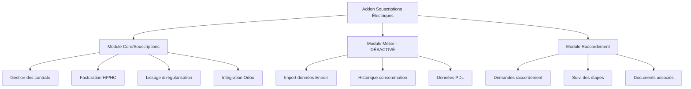

# Souscriptions Électriques pour Odoo

Un addon libre pour Odoo >=18 qui aide à gérer les abonnements électriques en France. Créé par [Virgile Daugé](https://github.com/virgiledauge), partagé sous licence AGPL-3 pour permettre l'émergence d'autres communs de l'électricité.

## Pourquoi ce projet existe ?

Parce que gérer un contrat d'électricité, c'est pas pareil que vendre des chaussettes ! 

Les abonnements électriques en France ont des spécificités que le module standard d'Odoo ne gère pas du tout :
- Les prix changent en cours de contrat (merci les fluctuations du marché et des taxes...)
- Il faut facturer avec les anciens prix quand on fait des régularisations
- Le lissage mensuel avec rattrapage, c'est un cauchemar avec les outils classiques
- Les tarifs heures pleines/creuses, les PDL, les trucs Enedis... bref, c'est complexe

Ce module remplace le système d'abonnement standard d'Odoo par quelque chose qui comprend vraiment comment fonctionne la fourniture d'électricité en France.

## État actuel du projet

🚧 **Phase d'exploration** - On découvre encore ce dont les gens ont vraiment besoin !

**Ce qui fonctionne déjà (Phase 1) :**
- ✅ Gestion des contrats avec facturation mensuelle
- ✅ Support des tarifs HP/HC et Base  
- ✅ Lissage des factures avec régularisation
- ✅ Intégration propre dans Odoo (facturation, comptabilité, etc.)
- ✅ Module de demandes de raccordement
- ✅ Interface utilisateur pour les abonnés (portail web)

**Ce qui arrive bientôt (Phase 2) :**
- 🔄 Import automatique des données Enedis (historique, index, etc.)
- 🔄 Rapports avancés avec tout l'historique

## Architecture du projet



## Installation rapide

### Avec Docker (recommandé pour tester)

```bash
# Cloner le projet
git clone https://github.com/votre-repo/souscriptions_odoo.git
cd souscriptions_odoo

# Lancer avec des données d'exemple
docker compose -f docker/docker-compose.demo.yml up

# Accéder à Odoo : http://localhost:8069
# Compte admin : admin / admin
```

### Installation manuelle

**Prérequis :**
- Odoo 18+ installé
- PostgreSQL qui tourne  
- Python 3.13+
- Poetry pour gérer les dépendances

```bash
# Installer les dépendances Python
poetry install

# Créer une base de données et installer l'addon
createdb votre_base_souscriptions
odoo-bin -d votre_base_souscriptions -i souscriptions --without-demo=False

# Lancer Odoo en mode développement
odoo-bin -d votre_base_souscriptions --dev=reload,qweb,werkzeug,xml
```

## Comment ça marche ?

### 1. Créer un contrat de souscription

Dans Odoo, allez dans **Souscriptions > Contrats** et créez un nouveau contrat :
- Choisissez votre contact/client
- Définissez le Point de Livraison (PDL)
- Configurez le type de facturation (Base ou HP/HC)
- Activez le lissage si vous voulez lisser les factures

### 2. Configurer les tarifs

Les prix sont gérés par des **grilles de prix** dans **Souscriptions > Configuration > Grilles de prix** :
- Prix de l'abonnement mensuel
- Prix du kWh (Base ou HP/HC séparément)
- Historique des changements de prix automatique

### 3. Générer les factures

Les factures se créent automatiquement selon la périodicité configurée. Le système :
- Calcule automatiquement les montants HP/HC
- Gère le lissage avec régularisation
- S'intègre avec la comptabilité Odoo
- Génère les PDF avec le bon template

### 4. Interface utilisateur (portail)

Vos abonnés peuvent se connecter sur le portail Odoo pour :
- Voir leurs contrats en cours
- Consulter leurs factures
- Télécharger les documents
- Faire des demandes de raccordement

## Technologies utilisées

- **Odoo 18+** avec le nouveau framework OWL
- **Poetry** pour gérer proprement les dépendances Python
- **Docker** pour faciliter les tests et déploiements
- **PostgreSQL** pour stocker toutes les données
- **Pandas/FastParquet** pour traiter les gros fichiers de données Enedis (Phase 2)

## Structure du projet

```
souscriptions_odoo/
├── models/           # Toute la logique métier
│   ├── core/         # Contrats, facturation, tarifs
│   ├── metier/       # Données Enedis (Phase 2)
│   └── raccordement/ # Demandes de raccordement
├── views/            # Interfaces utilisateur Odoo
├── data/             # Configuration par défaut
├── demo/             # Données d'exemple pour tester
├── tests/            # Tests pour vérifier que ça marche
├── docker/           # Configuration Docker
└── reports/          # Templates de factures et rapports
```

## Tester avec les données d'exemple

Le projet inclut des données d'exemple pour voir comment ça fonctionne :

```bash
# Avec Docker
cd docker
./scripts/demo_simple.sh

# Ou en manuel
odoo-bin -d test_souscriptions -i souscriptions --without-demo=False
```

Vous aurez alors :
- Des contrats d'exemple avec différentes configurations
- Des grilles de prix réalistes
- Des factures générées automatiquement
- Des demandes de raccordement en cours

## Compatibilité et dépendances

**Version Odoo requise :** 18+

**Modules Odoo nécessaires :**
- `base` (obligatoire)
- `mail` (gestion des messages)
- `contacts` (clients/fournisseurs)
- `account` (facturation)
- `portal` (interface utilisateur)

**Dépendances Python :**
- `pandas` et `fastparquet` (pour la Phase 2)
- `babel` (dates en français)
- `psycopg2` (base de données)