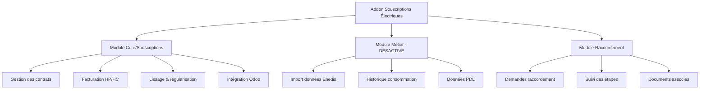

# Souscriptions Électriques pour Odoo

[](https://github.com/Energie-De-Nantes/souscriptions_odoo/actions/workflows/tests.yml)

Un addon libre pour Odoo 19 qui aide à gérer les abonnements électriques en France. Créé par [Virgile Daugé](https://github.com/virgiledauge), partagé sous licence AGPL-3 pour permettre l'émergence d'autres communs de l'électricité.

## Pourquoi ce projet existe ?

Parce que gérer un contrat d'électricité, c'est pas pareil que vendre des chaussettes ! 

Les abonnements électriques en France ont des spécificités que le module standard d'Odoo ne gère pas du tout :
- Les prix changent en cours de contrat (merci les fluctuations du marché et des taxes...)
- Il faut facturer avec les anciens prix quand on fait des régularisations
- Le lissage mensuel avec rattrapage, c'est un cauchemar avec les outils classiques
- Les tarifs heures pleines/creuses, les PDL, les trucs Enedis... bref, c'est complexe

Ce module remplace le système d'abonnement standard d'Odoo par quelque chose qui comprend vraiment comment fonctionne la fourniture d'électricité en France.

## État actuel du projet

🚧 **Phase d'exploration** - On découvre encore ce dont les gens ont vraiment besoin !

**Ce qui fonctionne déjà (Phase 1) :**
- ✅ Gestion des contrats avec facturation mensuelle
- ✅ Support des tarifs HP/HC et Base  
- ✅ Lissage des factures avec régularisation
- ✅ Intégration propre dans Odoo (facturation, comptabilité, etc.)
- ✅ Module de demandes de raccordement
- ✅ Interface utilisateur pour les abonnés (portail web)

**Ce qui arrive bientôt (Phase 2) :**
- 🔄 Import automatique des données Enedis (historique, index, etc.)
- 🔄 Rapports avancés avec tout l'historique

## Architecture du projet


```mermaid
graph TD
    A[Addon Souscriptions Électriques] --> B[Module Core/Souscriptions]
    A --> C[Module Métier - DÉSACTIVÉ]
    A --> D[Module Raccordement]
    
    B --> E[Gestion des contrats]
    B --> F[Facturation HP/HC]
    B --> G[Lissage & régularisation]
    B --> H[Intégration Odoo]
    
    C --> I[Import données Enedis]
    C --> J[Historique consommation]
    C --> K[Données PDL]
    
    D --> L[Demandes raccordement]
    D --> M[Suivi des étapes]
    D --> N[Documents associés]
```

## Installation rapide

### Avec Docker (recommandé pour tester)

```bash
# Cloner le projet
git clone https://github.com/votre-repo/souscriptions_odoo.git
cd souscriptions_odoo

# Lancer avec des données d'exemple
docker compose -f docker/docker-compose.demo.yml up

# Accéder à Odoo : http://localhost:8069
# Compte admin : admin / admin
```

### Installation manuelle

**Prérequis :**
- Odoo 19 installé
- PostgreSQL qui tourne
- Python 3.13+

```bash
# Créer une base de données et installer l'addon (nom technique : souscriptions_odoo)
createdb votre_base_souscriptions
odoo -d votre_base_souscriptions -i souscriptions_odoo

# Lancer Odoo en mode développement
odoo -d votre_base_souscriptions --dev=reload,qweb,werkzeug,xml
```

## Comment ça marche ?

### 1. Créer un contrat de souscription

Dans Odoo, allez dans **Souscriptions > Contrats** et créez un nouveau contrat :
- Choisissez votre contact/client
- Définissez le Point de Livraison (PDL)
- Configurez le type de facturation (Base ou HP/HC)
- Activez le lissage si vous voulez lisser les factures

### 2. Configurer les tarifs

Les prix sont gérés par des **grilles de prix** dans **Souscriptions > Configuration > Grilles de prix** :
- Prix de l'abonnement mensuel
- Prix du kWh (Base ou HP/HC séparément)
- Historique des changements de prix automatique

### 3. Générer les factures

Les factures se créent automatiquement selon la périodicité configurée. Le système :
- Calcule automatiquement les montants HP/HC
- Gère le lissage avec régularisation
- S'intègre avec la comptabilité Odoo
- Génère les PDF avec le bon template

### 4. Interface utilisateur (portail)

Vos abonnés peuvent se connecter sur le portail Odoo pour :
- Voir leurs contrats en cours
- Consulter leurs factures
- Télécharger les documents
- Faire des demandes de raccordement

## Technologies utilisées

- **Odoo 18+** avec le nouveau framework OWL
- **uv** pour gérer proprement les dépendances Python
- **Docker** pour faciliter les tests et déploiements
- **PostgreSQL** pour stocker toutes les données
- **Pandas/FastParquet** pour traiter les gros fichiers de données Enedis (Phase 2)

## Structure du projet

```
souscriptions_odoo/
├── models/           # Toute la logique métier
│   ├── core/         # Contrats, facturation, tarifs
│   ├── metier/       # Données Enedis (Phase 2)
│   └── raccordement/ # Demandes de raccordement
├── views/            # Interfaces utilisateur Odoo
├── data/             # Configuration par défaut
├── demo/             # Données d'exemple pour tester
├── tests/            # Tests pour vérifier que ça marche
├── docker/           # Configuration Docker
└── reports/          # Templates de factures et rapports
```

## Explorer l'interface (instance vivante)

Pour lancer une instance Odoo 19 complète avec des données d'exemple et cliquer
dans l'interface :

```bash
./scripts/run-app.sh
# puis ouvrir http://localhost:8069   (identifiants : admin / admin)
```

Le script démarre PostgreSQL, installe le module **avec les données de démo**
(`--with-demo` ; sous Odoo 19 la démo n'est plus chargée par défaut), puis sert
l'application. La base est persistée : les modifications faites dans l'UI sont
conservées entre deux lancements. `Ctrl-C` arrête le serveur ;
`./scripts/run-app.sh --reset` repart d'une base vierge.

Vous y trouverez :
- **Souscriptions** (menu principal) : 5 contrats d'exemple (Base, HP/HC, solidaire, pro)
- **Souscriptions → Grilles de Prix** : grille tarifaire avec un prix par puissance
- **Raccordements** : tableau kanban de demandes de raccordement à différentes étapes
- Le **portail client** sur `/my` : pour le tester, donnez un accès portail à un
  contact de démo (Contacts → sélectionner un client → *Action → Accorder l'accès au portail*),
  définissez-lui un mot de passe, puis connectez-vous avec ce compte.

## Lancer les tests automatisés

La suite (91 tests) tourne sur `odoo:19` + PostgreSQL via Docker, sans
installation locale d'Odoo. Le plus simple :

```bash
./scripts/run-tests.sh
```

Le script démarre PostgreSQL, installe le module, lance la suite, nettoie les
conteneurs et renvoie le bon code de sortie. Pour la commande Docker manuelle,
la sélection par tag, la CI et le dépannage : [tests/README.md](tests/README.md).
La même suite s'exécute automatiquement en CI à chaque push et PR (badge en haut).

## Compatibilité et dépendances

**Version Odoo requise :** 19

**Modules Odoo nécessaires :**
- `base` (obligatoire)
- `mail` (gestion des messages)
- `contacts` (clients/fournisseurs)
- `account` (facturation)
- `portal` (interface utilisateur)

**Dépendances Python :**
- `pandas` et `fastparquet` (pour la Phase 2)
- `babel` (dates en français)
- `psycopg2` (base de données)