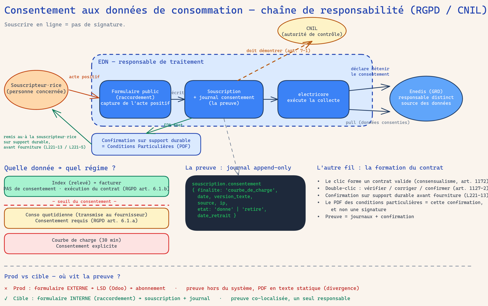

# Le consentement (données de consommation)

## En deux mots

Pour facturer, le relevé du compteur suffit : aucune autorisation à demander,
c'est l'exécution normale du contrat. Pour aller plus loin — la consommation
jour par jour, la courbe détaillée heure par heure — il faut la permission
explicite de la personne. Cette permission se donne, se retire, et chaque
geste laisse une trace datée qu'on garde pour toujours, sans jamais l'effacer.

## Le geste au quotidien

### À l'entrée : les cases de la demande de raccordement

Aujourd'hui, le consentement se capte à l'entrée du contrat, sur la **fiche
Demande de raccordement**, onglet **« Adhésion & consentement »** (voir
[raccordement](raccordement.md) pour le workflow complet).

Le groupe **« Consentement données de consommation (RGPD¹) »** porte deux
cases, une par finalité :

- **Consentement — consommations quotidiennes**
- **Consentement — courbe de charge**

Trois règles simples pour la personne qui saisit :

- **Les cases ne sont jamais pré-cochées.** On coche uniquement ce que la
  personne a réellement accepté, finalité par finalité.
- **On ne groupe pas** : accepter la conso quotidienne n'implique pas la
  courbe de charge, et inversement.
- **On ne coche jamais « pour » quelqu'un·e.** Si le·la souscripteur·rice n'a
  rien dit, on laisse vide. Une case vide, c'est un « non » — et c'est très
  bien comme ça.

Cette saisie au back-office est une **preuve faible assumée** : à terme,
c'est le·la souscripteur·rice qui cochera ces cases sur un formulaire public
en ligne, et c'est cet acte-là qui fera foi. En attendant, la source de
chaque acte est tracée comme « back-office » — on ne se raconte pas
d'histoire sur la solidité de la preuve.

¹ RGPD : le Règlement général sur la protection des données, la loi
européenne qui encadre l'usage des données personnelles.

### Le bloc « Signature » : l'adhésion, ce n'est pas un consentement

Sur le même onglet, le groupe **« Signature »** porte la **Date de
signature** et la case **« Renonce au délai de rétractation »**. Attention à
ne pas confondre : ce sont des **actes d'adhésion au contrat** (accepter les
CGV, renoncer au délai de rétractation), pas des consentements de données.
Ils suivent un régime différent — on y revient dans les règles du jeu.

### Ensuite : l'onglet « Journal des actes » de la Souscription

Quand la Souscription naît de la demande (voir [contrat](contrat.md)), tout ce qui a été
coché et signé devient des lignes du **Journal des actes**, visible sur la
**fiche Souscription**, onglet **« Journal des actes »**. Chaque ligne
montre :

| Colonne | Ce qu'elle dit |
|---|---|
| Horodatage | quand l'acte a eu lieu |
| Finalité | sur quoi il porte (conso quotidienne, courbe de charge, CGV…) |
| État | **Donné** (badge vert) ou **Retiré** (badge rouge) |
| Version du texte | quel texte exact la personne a vu à ce moment-là |
| Source / canal | d'où vient l'acte (formulaire, back-office, portail…) |
| Date de retrait | quand le retrait prend effet, le cas échéant |

Le·la facturiste **lit** ce journal, il·elle n'y corrige rien : le journal
ne se modifie pas, il s'enrichit. Pour enregistrer un changement d'avis, on
**ajoute** un nouvel acte — jamais on ne retouche l'ancien.

### La chaîne de responsabilité : qui répond de quoi

Pourquoi tant de rigueur ? Parce que c'est la coopérative qui **déclare au
gestionnaire du réseau (Enedis)** détenir le consentement de la personne
avant de collecter ses données fines. Le jour où la CNIL — l'autorité de
contrôle des données personnelles — demande la preuve, c'est la coopérative
qui doit la produire. Le Journal des actes est cette preuve.

En clair : le·la souscripteur·rice donne (ou retire) son accord ; la
coopérative l'enregistre dans le journal et le déclare à Enedis ; Enedis
transmet les données ; la CNIL peut demander des comptes à la coopérative,
et à personne d'autre. Chaque maillon a son rôle, et la preuve vit chez nous.

!!! question "🤖 À valider avec vous"
    - Personne ne peut « cocher pour » quelqu'un·e : seul l'acte de la personne
      elle-même compte. La saisie back-office actuelle est un pis-aller
      tracé comme tel — le vrai point de capture sera un formulaire public
      en ligne (chantier en cours, avec l'activation de la collecte chez
      Enedis et le retrait depuis le portail). D'accord pour tenir cette
      rigueur d'ici là : case vide si la personne n'a rien exprimé ?
    - Aucun contrat migré de l'ancien système ne porte de consentement
      données de conso : il n'a jamais été capté. Le trou de conformité est
      désormais visible dans le journal (vide), et appelle une campagne de
      recueil auprès du parc existant. Qui la porte, et quand ?

## Les règles du jeu

### La distinction fondatrice : l'index ne demande rien

- **Facturer avec l'index** (le relevé périodique du compteur) ne demande
  **aucun consentement** : c'est l'exécution du contrat, sa base légale se
  suffit. On ne sur-demande pas — solliciter un consentement inutile, c'est
  brouiller le sens de ceux qui comptent.
- **Collecter plus fin** — consommations quotidiennes transmises au
  fournisseur, courbe de charge — exige un **consentement RGPD explicite** :
  un acte positif, spécifique (une finalité = un consentement), éclairé
  (la personne sait ce qu'elle accepte), et révocable à tout moment.

### Le journal est append-only : rien ne s'efface

- Chaque acte est une **ligne nouvelle** : consentement donné, consentement
  retiré, adhésion signée. Une ligne existante ne se modifie jamais et ne se
  supprime jamais — le système le refuse, même à un·e administrateur·rice.
- **Le retrait s'AJOUTE** : quand quelqu'un·e retire son consentement, on
  n'efface pas la ligne « donné », on ajoute une ligne « retiré ». L'histoire
  complète reste lisible : c'est elle, la preuve.
- **L'état courant d'une finalité = sa dernière ligne.** Dernière ligne
  « donné » → la collecte est autorisée ; dernière ligne « retiré » → elle
  ne l'est plus.
- **Pas d'acte = pas de preuve = non.** L'absence de ligne est la seule
  façon de dire « non ». On ne fabrique jamais une ligne sans acte réel.
- Chaque ligne fige la **version du texte** que la personne a vu : si le
  libellé du consentement change un jour, on sait exactement à quoi
  chacun·e a consenti.

### Deux natures d'actes dans le même journal

Le Journal des actes unifie deux régimes qu'il ne faut pas confondre :

| | Consentements RGPD | Actes d'adhésion |
|---|---|---|
| Exemples | conso quotidienne, courbe de charge | acceptation des CGV, renonciation au délai de rétractation |
| Révocable ? | **Oui**, à tout moment | **Non**, jamais |
| Le retrait | ajoute une ligne « retiré » | est **refusé** par le système |

On ne « retire » pas une signature : accepter les CGV est un acte
contractuel, pas une autorisation de données. Le journal accepte le retrait
sur les finalités RGPD et le refuse sur les finalités d'adhésion.

### Ce que les documents affichent

Le PDF des **conditions particulières** (la projection du contrat, voir
[contrat](contrat.md)) ne fait qu'**afficher ce que le journal prouve** : « Adhésion
validée le… » vient de la ligne d'acceptation des CGV, le paragraphe de
renonciation n'apparaît que si la ligne existe. Un acte absent du journal =
une mention absente du PDF. Le portail de l'usager·ère (voir [portail](portail.md))
suivra la même logique — et accueillera, à terme, le retrait en un clic.

### Les contrats migrés partent à zéro

L'ancien système n'a jamais capté ce consentement (seulement les CGV et un
accord de recontact). Les Souscriptions migrées ont donc un journal **sans
aucune ligne de consentement données de conso** — c'est voulu : plutôt un
trou de conformité visible qu'une fausse preuve fabriquée. Tant qu'aucun
acte n'est journalisé, la collecte fine n'est pas autorisée pour ces
contrats.

!!! question "🤖 À valider avec vous"
    - Facturer avec l'index ne demande aucun consentement ; le consentement
      ne porte que sur les données plus fines. Cette distinction est-elle
      claire pour toute l'équipe, y compris à l'accueil téléphonique ?
    - Le retrait ajoute une ligne, il n'efface rien — et les actes
      d'adhésion (CGV, renonciation au délai de rétractation) ne se
      « retirent » jamais. Ces deux régimes vous semblent-ils justes et
      explicables à un·e souscripteur·rice qui demande « effacez tout » ?

## Sous le capot

**Modèles Odoo** :

- [`models/core/souscription_consentement.py`](https://github.com/Energie-De-Nantes/souscriptions_odoo/blob/main/models/core/souscription_consentement.py)
  — le modèle `souscription.consentement` (nom technique historique du
  Journal des actes) : `write()` et `unlink()` lèvent une erreur
  (append-only), `create()` refuse un retrait sur les finalités
  irrévocables (`acceptation_cgv`, `renonciation_retractation`). La
  constante `CONSENT_TEXT_VERSION` fige la version du texte référencée par
  chaque ligne.
- [`models/core/souscription.py`](https://github.com/Energie-De-Nantes/souscriptions_odoo/blob/main/models/core/souscription.py)
  — `enregistrer_consentement()` (ajout d'une ligne), `etat_consentement()`
  et `_dernier_acte()` (état courant = dernière ligne), et la
  journalisation à la naissance depuis la demande de raccordement
  (`naitre_depuis_demande`).
- [`models/raccordement/raccordement_demande.py`](https://github.com/Energie-De-Nantes/souscriptions_odoo/blob/main/models/raccordement/raccordement_demande.py)
  — les champs d'intake transitoires (`consent_*`, `date_validation`,
  `renonce_retractation`), convertis en lignes de journal à la création de
  la Souscription.

**ADRs** :

- [ADR 0017 — Consentement données de conso : formulaire Odoo public + journal append-only](https://github.com/Energie-De-Nantes/souscriptions_odoo/blob/main/docs/adr/0017-consentement-donnees-conso-formulaire-odoo-journal-append-only.md)
  — l'ADR fondateur : preuve co-localisée avec la Souscription, EDN seul
  responsable de traitement, un booléen ne suffit pas.
- [ADR 0027 — Journal des actes unifié](https://github.com/Energie-De-Nantes/souscriptions_odoo/blob/main/docs/adr/0027-journal-des-actes-unifie-adhesion-irrevocable-consentements.md)
  — les actes d'adhésion rejoignent le journal, avec le garde
  d'irrévocabilité.
- [ADR 0016 — Documents contractuels : projections de la Souscription](https://github.com/Energie-De-Nantes/souscriptions_odoo/blob/main/docs/adr/0016-documents-contractuels-projection-souscription-consentements-raccordement.md)
  — les consentements sont captés au raccordement puis possédés par la
  Souscription, lus par les conditions particulières.
- [ADR 0023 — Migration des contrats (décision 5)](https://github.com/Energie-De-Nantes/souscriptions_odoo/blob/main/docs/adr/0023-migration-contrats-100pct-couture-regul-enjambante-backfill-cible.md)
  — acte que le journal est vide à la migration : le trou de conformité
  devient visible.

**Référence juridique détaillée** :
[docs/consentement-donnees-conso.md](https://github.com/Energie-De-Nantes/souscriptions_odoo/blob/main/docs/consentement-donnees-conso.md)
— la note complète (bases légales RGPD, consensualisme, gradation Enedis,
conservation de la preuve). Chantiers distincts annoncés par l'ADR 0017 :
formulaire public, activation/désactivation de la collecte chez Enedis (via
electricore / SGE), UI de retrait au portail.
