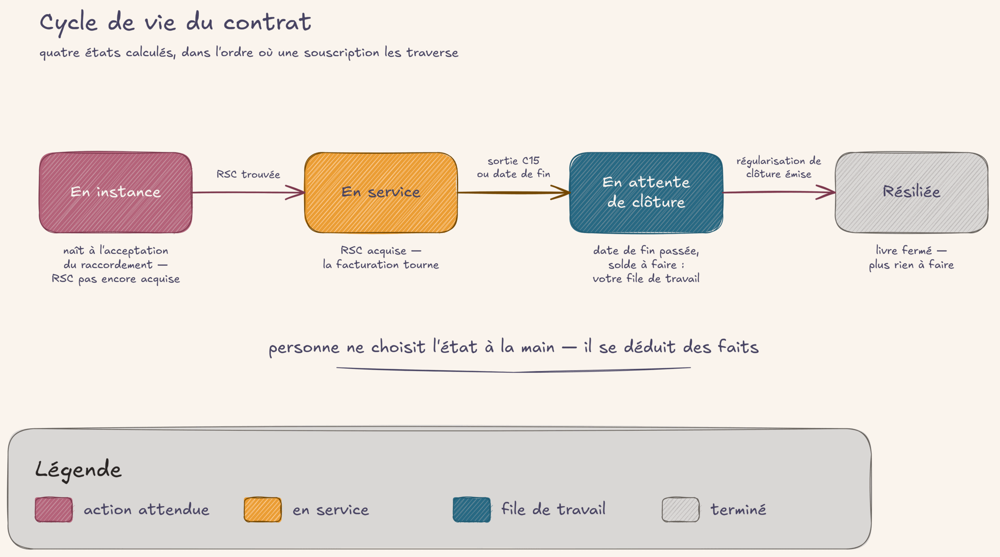

# Le contrat de fourniture

## En deux mots

Chaque personne fournie en électricité par le commun a une fiche de contrat : la Souscription.
Elle dit qui est fourni, où, à quel tarif, depuis quand — et tout le reste du logiciel s'appuie
dessus pour facturer. Son état (en instance, en service, en attente de clôture, résiliée) se lit
mais ne se choisit jamais : il se déduit de faits vérifiables. Cette page explique comment lire une
fiche, comment un contrat naît, vit et se termine, et quels documents en sortent.

## Le geste au quotidien

### L'annuaire des contrats

Tout part du menu **Souscriptions** : la liste de tous les contrats de fourniture, avec un badge
d'état par ligne. On y cherche par nom, titulaire, PDL (le numéro du point de livraison,
c'est-à-dire du compteur), RSC ou n° d'affaire Enedis. Les filtres prédéfinis suivent les quatre
états — **En instance**, **En service**, **En attente de clôture**, **Résiliée** — et deux filtres
méritent une attention régulière :

- **En instance sans id_Affaire** : les dossiers coincés, qui n'avanceront jamais tout seuls tant
  qu'on ne leur a pas renseigné leur n° d'affaire Enedis ;
- **En attente de clôture** : la liste de travail des sorties — chaque contrat qui s'y trouve
  attend qu'on solde son départ (voir [regulariser](regulariser.md), section « La sortie d'un·e usager·ère »).

Le filtre **Archivée** retrouve les contrats archivés (ruban « Archivée » sur la fiche) : ils
disparaissent des listes courantes mais restent consultables.

### La fiche Souscription

En ouvrant un contrat, on trouve : le·la titulaire et les cotitulaires, les dates de début et de
fin, puis le groupe **Caractéristiques facturantes** (puissance, tarif Base ou HP/HC, lissage et
provisions, tarif solidaire, majoration PRO — les prix eux-mêmes vivent dans les grilles, voir
[prix](prix.md)), le groupe **Point de livraison** et le groupe **Paiement**. En haut, les boutons stat
**Factures**, **Régularisations** et **Chronologie** ouvrent tout ce qui gravite autour du contrat.
Le fil de discussion en bas de fiche garde la trace des échanges et des changements.

Deux champs hérités de l'ancien système se croisent tous les jours :

- **Adresse du PDL** (groupe Point de livraison) : l'adresse du compteur, distincte de l'adresse
  du·de la souscripteur·rice — la personne peut habiter ailleurs (locatif, second logement) ;
- **Blaze**, sur la fiche contact : le nom d'usage choisi par la personne, distinct de son nom
  légal. C'est le blaze qu'on emploie quand on s'adresse à elle.

### La naissance et le démarrage

Un contrat ne se crée pas à la main : il naît du parcours de raccordement (voir [raccordement](raccordement.md)),
en état « en instance ». À ce stade il lui manque sa RSC — la référence contractuelle Enedis qui le
rend facturable. Chaque nuit, un automate interroge Enedis et fait avancer tout seul les contrats
qui ont obtenu leur RSC : plus besoin d'aller vérifier sur le portail SGE (le guichet Enedis des fournisseurs). Pour ne pas attendre la
nuit, le bouton **Résoudre la RSC maintenant** (visible sur une fiche en instance) force la
recherche tout de suite. L'onglet **Électricore** montre cette identité Enedis — RSC et n° d'affaire
— et permet de corriger une faute de frappe sur le n° d'affaire.

### La sortie

Le bouton **Tirer les sorties C15**, en tête de la liste Souscriptions, va chercher chez Enedis les
résiliations et fins de contrat notifiées. Les contrats concernés reçoivent leur date de fin et
passent « en attente de clôture ». À partir de là, le filtre **En attente de clôture** est votre
file de travail : chaque départ s'y traite en facturant le mois du départ puis en soldant la
régularisation de clôture — le pas-à-pas complet est dans [regulariser](regulariser.md), section « La sortie
d'un·e usager·ère ». Une fois la clôture soldée, le contrat passe « résiliée » tout seul.

### Les documents et la chronologie

Depuis la fiche, le menu **Imprimer** produit deux PDF :

- **Conditions particulières** : le document contractuel personnalisé (puissance, tarif,
  mensualités), aussi joint automatiquement au mail de bienvenue ;
- **Attestation de fourniture** : le justificatif court, sans prix ni signature, qui atteste
  qu'une personne est fournie à cette adresse — pour la CAF, un bailleur, une démarche
  administrative.

Le bouton **Chronologie** ouvre le journal Enedis du contrat sur un seul écran : événements
contractuels (changement de puissance, de formule...), relevés d'index et périodes d'énergie,
filtrables par type. C'est là qu'on va comprendre « ce qui s'est passé chez Enedis » quand un mois
surprend.

!!! question "🤖 À valider avec vous"
    - La liste « En attente de clôture » suffit-elle comme file de travail des départs — un contrat
      en sort tout seul quand sa clôture est soldée, sans case « traité » à cocher ? C'est un suivi
      qui vous convient ?
    - On distingue trois documents : les conditions particulières (le PDF propre à la personne),
      les CGV (le cadre générique) et l'attestation de fourniture (le justificatif court pour les
      tiers, sans prix). Ce vocabulaire vous parle ?

## Les règles du jeu

**L'état ne se choisit jamais.** Les quatre états se déduisent de faits :

- **En instance** : pas encore de RSC — le contrat n'est pas facturable ;
- **En service** : RSC acquise — le contrat entre dans la facturation mensuelle. Un contrat dont la
  date de fin est connue mais pas encore passée reste « en service » jusqu'au lendemain de son
  dernier jour servi ;
- **En attente de clôture** : date de fin passée, clôture pas encore soldée ;
- **Résiliée** : clôture soldée — le mois du départ est facturé ET la régularisation de clôture est
  émise (ou il n'y avait rien à solder).

Pour débloquer un dossier, on corrige donc le fait (la RSC manquante, le n° d'affaire erroné, la
sortie Enedis pas encore tirée), jamais l'étiquette.

**Le contrat s'identifie par la RSC, pas par le compteur.** Deux personnes qui se succèdent sur un
même PDL font deux contrats distincts, chacun avec sa propre RSC. Le PDL sert à chercher et à
s'orienter ; la RSC est la clé qui rattache les consommations au bon contrat. Une même RSC ne peut
exister que sur un seul contrat. Sa saisie manuelle est réservée au rôle gestionnaire — c'est
l'échappatoire quand le suivi automatique déraille, pas le geste courant.

**La date de fin a un auteur unique : le message officiel Enedis (C15).** Elle vaut « dernier jour
servi » et ne se saisit jamais à la main. Un départ annoncé en avance ou une résiliation exécutée
en retard se traitent en geste commercial sur la facturation, pas en changeant la date.

**Les documents sont des projections, pas des archives.** Conditions particulières et attestation
se régénèrent à la demande depuis la fiche — ils reflètent toujours l'état actuel du contrat. Les
preuves d'engagement (signature, acceptation des CGV, renonciation au délai de rétractation) vivent
ailleurs : dans le Journal des actes, un registre horodaté où rien ne s'efface (voir
[consentement](consentement.md)).

**Les contrats migrés valent les autres.** Tous les contrats de l'ancien système ont été repris, y
compris les résiliés ; l'ancien système est une archive morte qu'on ne consulte plus au quotidien.

Point en chantier, à connaître : la **demande de résiliation sortante** (la personne nous appelle
et c'est nous qui déposons la demande chez Enedis) n'a pas encore d'écran dédié — sa sortie
retombera dans l'entonnoir habituel des sorties C15. La direction est prise, l'outillage suivra.

!!! question "🤖 À valider avec vous"
    - Un même compteur servi par deux personnes successives = deux contrats distincts, distingués
      par la référence Enedis (RSC) ; le PDL n'est qu'une information d'affichage et de recherche.
      C'est bien votre découpage mental ?
    - La date de fin vient du message officiel Enedis et vaut « dernier jour servi » — jamais de
      saisie à la main, les écarts se traitent en geste commercial. D'accord avec ce principe ?

## Sous le capot

Modèles principaux :

- [`models/core/souscription.py`](https://github.com/Energie-De-Nantes/souscriptions_odoo/blob/main/models/core/souscription.py) — le modèle `souscription.souscription` : états calculés (`_compute_etat`), naissance depuis le raccordement, pull des sorties C15, contrainte d'unicité RSC, champ migration `adresse_pdl` ;
- [`models/core/res_partner.py`](https://github.com/Energie-De-Nantes/souscriptions_odoo/blob/main/models/core/res_partner.py) — le champ `blaze` sur le contact ;
- [`models/core/souscription_chronologie.py`](https://github.com/Energie-De-Nantes/souscriptions_odoo/blob/main/models/core/souscription_chronologie.py) — la chronologie (faits contractuels, relevés, périodes) ;
- [`models/core/electricore_rsc_service.py`](https://github.com/Energie-De-Nantes/souscriptions_odoo/blob/main/models/core/electricore_rsc_service.py) — la résolution de la RSC via electricore ;
- [`reports/souscription_conditions_particulieres_report.xml`](https://github.com/Energie-De-Nantes/souscriptions_odoo/blob/main/reports/souscription_conditions_particulieres_report.xml) et [`reports/souscription_attestation_report.xml`](https://github.com/Energie-De-Nantes/souscriptions_odoo/blob/main/reports/souscription_attestation_report.xml) — les deux PDF.

Décisions d'architecture :

- [ADR 0010](https://github.com/Energie-De-Nantes/souscriptions_odoo/blob/main/docs/adr/0010-identite-souscription-rsc-cle-id-affaire-amorce.md) — la RSC comme identité du contrat, l'id_Affaire comme amorce ;
- [ADR 0021](https://github.com/Energie-De-Nantes/souscriptions_odoo/blob/main/docs/adr/0021-chaine-raccordement-pilotee-faits-naissance-instance-rsc-poll.md) — états déduits des faits, naissance en instance, RSC acquise par poll ;
- [ADR 0031](https://github.com/Energie-De-Nantes/souscriptions_odoo/blob/main/docs/adr/0031-fin-souscription-gouvernee-fait-c15-sorties-tirees-cloture-campagne.md) — la fin gouvernée par le fait C15, la clôture soldée à la campagne ;
- [ADR 0016](https://github.com/Energie-De-Nantes/souscriptions_odoo/blob/main/docs/adr/0016-documents-contractuels-projection-souscription-consentements-raccordement.md) — les documents comme projections régénérées ;
- [ADR 0027](https://github.com/Energie-De-Nantes/souscriptions_odoo/blob/main/docs/adr/0027-journal-des-actes-unifie-adhesion-irrevocable-consentements.md) — le journal des actes unifié ;
- [ADR 0023](https://github.com/Energie-De-Nantes/souscriptions_odoo/blob/main/docs/adr/0023-migration-contrats-100pct-couture-regul-enjambante-backfill-cible.md) — la migration des contrats à 100 %.
