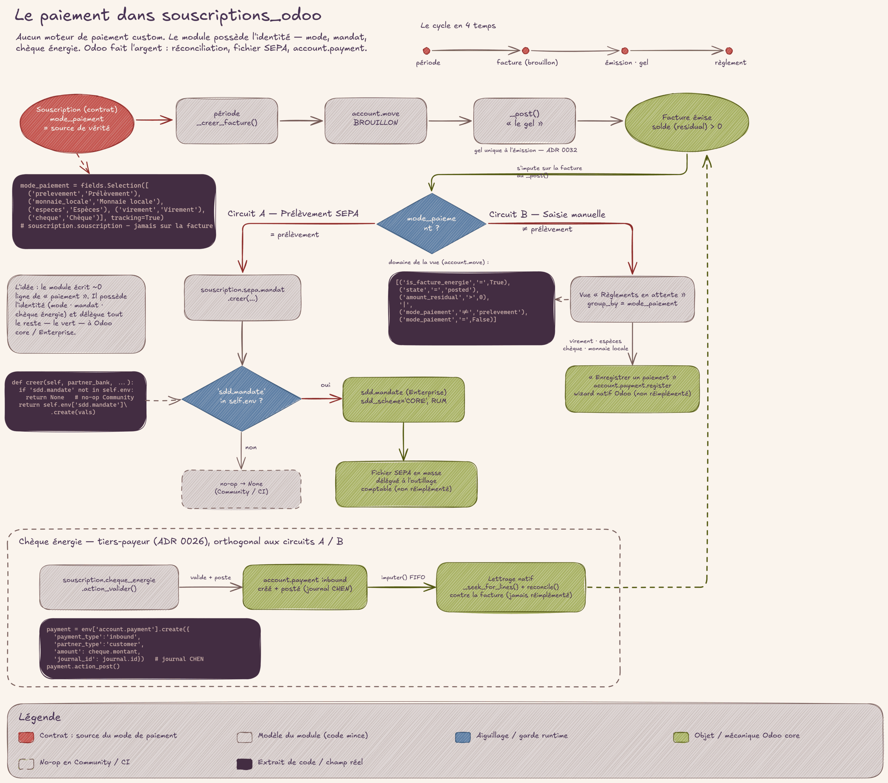

# Encaisser

## En deux mots

Une fois les factures envoyées, il reste à recevoir l'argent. Chaque contrat dit
comment son ou sa titulaire paie : prélèvement, monnaie locale, espèces, virement
ou chèque. Une vue unique montre tout ce qui reste à encaisser, un bouton d'étape
prépare les prélèvements du mois, et le chèque énergie — l'aide de l'État — a son
registre à lui, du courrier reçu jusqu'au paiement des factures.

## Le geste au quotidien

Le mode de paiement est écrit sur la Souscription, une fois pour toutes (et
modifiable si la personne change d'avis). On ne le devine jamais : avoir un IBAN
enregistré ne veut pas dire « prélèvement ». Le·la facturiste lit le mode, point.
Deux Souscriptions d'une même personne peuvent d'ailleurs porter deux modes
différents. Les instructions de paiement envoyées avec la facture s'adaptent à ce
mode — voir [mails](mails.md).

### Les prélèvements : un bouton dans la campagne

Sur la fiche Campagne, phase « Solder », l'étape **Préparer les prélèvements**
ouvre la liste de toutes les factures en mode prélèvement qui restent dues — y
compris les rattrapages des mois précédents, pas seulement le mois de la
campagne. De là, le·la facturiste lance le fichier de prélèvement en masse avec
l'outillage comptable standard. Le module prépare la liste ; il ne crée ni
paiement ni fichier lui-même. Le mandat de prélèvement, lui, naît actif dès
l'acceptation du raccordement (voir [raccordement](raccordement.md)).

### Tout le reste : la vue « Règlements en attente »

Menu **Souscriptions → Règlements en attente** : c'est l'endroit unique où voir
ce qui reste à encaisser hors prélèvement. On y trouve toutes les factures émises
avec un reste à payer, groupées par mode de paiement — y compris un groupe
« (vide) » pour les contrats dont le mode n'est pas renseigné, à compléter sur la
Souscription. Une facture soldée sort de la liste d'elle-même.

Dans cette vue, deux gestes selon le mode :

- **Monnaie locale (Moneko) et espèces** : le bouton **Encaisser** sur la ligne.
  Un clic atteste que l'argent est reçu ce jour-là et solde la facture. C'est le
  seul geste — ces paiements ne laisseront jamais de trace bancaire, c'est donc
  au·à la facturiste d'en attester.
- **Virement et chèque bancaire** : aucun bouton. C'est le relevé bancaire qui
  fait foi, via le rapprochement bancaire standard (l'action native
  « Enregistrer un paiement » ou le lettrage du relevé). On n'atteste jamais à la
  main un paiement qui laissera une trace en banque.

Le journal cible de l'encaissement une-clic (celui de la monnaie locale) se règle
dans **Paramètres → Souscriptions**, bloc « Encaissement » — un réglage à faire
une fois, avec les droits comptables.

### Le chèque énergie : un circuit complet

Le chèque énergie arrive par courrier. Son circuit tient en trois temps :

1. **Réception** : le·la facturiste l'enregistre dans le menu
   **Souscriptions → Chèques énergie** (ou depuis l'onglet **Chèques énergie**
   de la fiche Souscription) — numéro, montant, date d'expiration. Le chèque est
   à l'état « Reçu » : il n'est pas encore utilisable.
2. **Validation** : après avoir saisi le chèque sur le site de l'État, le·la
   facturiste clique **Valider** sur la fiche du chèque. C'est là que l'argent
   entre au livre : la validation crée automatiquement le paiement du
   tiers-payeur (l'État paie à la place de l'usager·ère) — la comptabilité est
   déjà branchée, rien d'autre à faire.
3. **Imputation** : à l'émission des factures suivantes de la personne, le
   chèque validé s'impute tout seul, sans geste. La fiche du chèque montre en
   permanence son solde restant (« non entamé », « en cours », « épuisé »).

Un filtre **Expire dans les 30 jours** aide à ne pas laisser un chèque reçu
dépasser sa date limite de saisie sur le site de l'État.

!!! question "🤖 À valider avec vous"
    - Pour un virement ou un chèque bancaire, on n'atteste jamais l'encaissement
      à la main : le relevé bancaire fait foi. Le bouton une-clic « Encaisser »
      n'existe que pour Moneko et les espèces, qui ne laissent aucune trace
      bancaire. Cette séparation est la bonne ?
    - Cliquer « Encaisser » affirme que l'argent est reçu ce jour-là — et il n'y
      a pas de case à décocher : une erreur se corrige en annulant le paiement
      côté comptabilité. Le geste « une-clic, un seul sens » vous convient ?
    - Point en chantier : aujourd'hui seul le journal monnaie locale se règle
      dans Paramètres → Souscriptions ; la direction prise est d'y exposer aussi
      les journaux espèces et prélèvement sur une page de configuration dédiée.

## Les règles du jeu

**Le mode de paiement est porté par le contrat.** Chaque Souscription porte son
mode ; il ne se déduit ni d'un IBAN ni d'une habitude. Une facture sans mode
apparaît dans le groupe « (vide) » des Règlements en attente : le signal qu'une
Souscription est à compléter (voir [contrat](contrat.md)).

**L'encaissement une-clic est une attestation pure.** Il n'existe que pour les
modes qui ne produiront jamais de trace bancaire (monnaie locale, espèces). Le
paiement naît au moment du clic — jamais avant, jamais à l'émission de la
facture. Créer ce paiement, c'est affirmer « encaissé » : il n'y a pas de retour
en arrière par simple dé-clic, une erreur se corrige en annulant le paiement.

**Préparer n'est pas prélever.** L'étape de campagne rassemble les factures dues
en mode prélèvement, rattrapages compris. L'exécution (fichier de prélèvement,
envoi à la banque) reste le travail de l'outillage comptable standard, jamais
celui du module.

**Le chèque énergie n'est jamais une réduction.** La facture reste entière —
mêmes montants, mêmes taxes — et le chèque la paie en partie. L'usager·ère lit
sur sa facture « payé / reste à payer », pas un prix raboté (voir [facture](facture.md)).

**La validation manuelle est la seule porte.** Aucun signal automatique ne vient
de l'État : tant que le·la facturiste n'a pas cliqué Valider (après la saisie
sur le site étatique), le chèque est inutilisable. Un chèque rejeté ou expiré ne
peut pas être validé.

**L'expiration borne la validation, jamais l'imputation.** Une fois validé, un
chèque reste utilisable même passé sa date d'expiration : l'argent est déjà au
livre. La date d'expiration ne sert plus alors qu'à ordonner la consommation.

**FIFO par expiration, jamais de facture négative.** Quand une personne détient
plusieurs chèques validés, on consomme d'abord celui qui expire le plus tôt, à
hauteur du montant de la facture. Le reliquat attend la facture suivante.
L'imputation se fait à l'émission de la facture — jamais sur un brouillon.

**Après coup, c'est la main qui corrige.** Un rejet ou une expiration découverts
après imputation se corrigent manuellement en comptabilité — aucun automatisme
ne détricote un paiement déjà imputé.

!!! question "🤖 À valider avec vous"
    - Le chèque énergie n'apparaît jamais en ligne de réduction : la facture
      reste entière et se lit en « payé / reste à payer ». C'est bien ce que
      vous voulez montrer aux usager·ères ?
    - Un chèque n'est utilisable qu'après votre validation manuelle (post-saisie
      sur le site de l'État), mais une fois validé il reste consommable même
      expiré ; et entre plusieurs chèques, on consomme d'abord celui qui expire
      le plus tôt. Ces règles collent-elles à la réalité administrative ?

## Sous le capot

- **Modèles** :
  [`models/core/account_move.py`](https://github.com/Energie-De-Nantes/souscriptions_odoo/blob/main/models/core/account_move.py)
  (bouton `action_encaisser`, résolution du journal, déclenchement de
  l'imputation des chèques à l'émission),
  [`models/core/souscription_cheque_energie.py`](https://github.com/Energie-De-Nantes/souscriptions_odoo/blob/main/models/core/souscription_cheque_energie.py)
  (`souscription.cheque_energie` : cycle reçu → validé → rejeté/expiré,
  `action_valider` crée l'`account.payment` tiers-payeur, `imputer()` fait le
  FIFO ; le solde est une projection du lettrage natif, jamais recalculé à la
  main),
  [`models/core/souscription_campagne.py`](https://github.com/Energie-De-Nantes/souscriptions_odoo/blob/main/models/core/souscription_campagne.py)
  (`action_preparer_prelevements`, étape `preparer_prelevements` de la phase
  Solder),
  [`models/core/souscription_sepa_mandat.py`](https://github.com/Energie-De-Nantes/souscriptions_odoo/blob/main/models/core/souscription_sepa_mandat.py)
  (mandat créé actif à l'acceptation du raccordement).
- **Vues** :
  [`views/core/account_move_views.xml`](https://github.com/Energie-De-Nantes/souscriptions_odoo/blob/main/views/core/account_move_views.xml)
  (liste « Règlements en attente », domaine reste-à-payer > 0 et mode ≠
  prélèvement, groupée par `mode_paiement`),
  [`views/core/souscription_cheque_energie_views.xml`](https://github.com/Energie-De-Nantes/souscriptions_odoo/blob/main/views/core/souscription_cheque_energie_views.xml)
  (registre, filtre « Expire dans les 30 jours »).
- **ADRs** :
  [ADR 0026 — chèque énergie tiers-payeur](https://github.com/Energie-De-Nantes/souscriptions_odoo/blob/main/docs/adr/0026-cheque-energie-tiers-payeur-modele-propre-delegue-paiement.md),
  [ADR 0033 — encaissement une-clic attestation pure](https://github.com/Energie-De-Nantes/souscriptions_odoo/blob/main/docs/adr/0033-encaissement-une-clic-attestation-pure-reouverture-bornee-option-b.md),
  [ADR 0032 — le brouillon gouverne, gel à l'émission](https://github.com/Energie-De-Nantes/souscriptions_odoo/blob/main/docs/adr/0032-brouillon-gouverne-gel-a-lemission.md)
  (l'imputation exige des écritures postées, donc jamais sur un brouillon).
