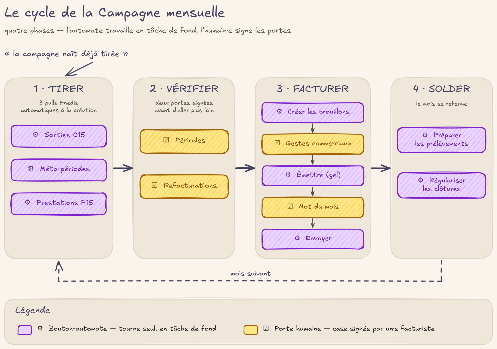

# Piloter la campagne du mois

## En deux mots

Chaque mois écoulé a son tableau de bord : la Campagne de facturation. C'est la
check-list partagée du·de la facturiste — elle rapatrie les données toute seule
dès sa création, puis déroule quatre temps : Tirer, Vérifier, Facturer, Solder.
La machine tire et calcule ; l'humain vérifie, décide et engage. Rien de
définitif ne part sans qu'une personne ait ouvert une porte, et tout ce que les
automates font se lit dans le journal de la campagne.

## Le geste au quotidien

### Ouvrir la campagne du mois

Menu **Souscriptions → Cycle de facturation** : l'historique des campagnes, une
ligne par mois avec les étapes faites, le nombre de factures émises et le total
TTC. Le bouton **Nouveau** crée la campagne du mois — uniquement pour un mois
entièrement révolu (la campagne de mars s'ouvre en avril, jamais avant).

Dès la création, la campagne **naît tirée** : sans autre clic, l'automate lance
les trois rapatriements de la phase Tirer dans les secondes qui suivent, puis
vous notifie du résultat. Un filet quotidien reprend ce qui aurait échoué.

### La matrice des étapes

L'onglet **Étapes** de la fiche Campagne est la check-list ordonnée du mois,
groupée en quatre phases. Chaque ligne annonce la couleur : prête, faite, ou
« Bloquée par : … » avec le nom des étapes qui lui manquent — pas besoin de
connaître l'enchaînement par cœur. Deux boutons par ligne :

- **Lancer** : agir (déclencher un rapatriement, créer ou émettre les factures) ;
- **Voir** : ouvrir la liste concernée pour contrôler (les périodes du mois, les
  factures du mois, les refacturations…).

### Les quatre phases

**Tirer** — trois rapatriements de données du gestionnaire de réseau (Enedis),
via notre moteur de calcul electricore : **Pull sorties C15** (les sorties de
contrat), **Pull méta-périodes** (les consommations du mois, qui créent les
périodes de facturation), **Sync F15** (les prestations à refacturer). Lancés
seuls à la création, relançables à volonté : un nouveau passage rattrape ce qui
manquait.

**Vérifier** — deux portes humaines : **Vérif périodes** et **Vérif
refacturations**. Le·la facturiste ouvre « Voir », scanne la masse, contrôle
les lignes douteuses (le contenu de cette relecture est détaillé dans
[facture](facture.md)), puis coche la porte. La coche est signée : qui a validé, quand.

**Facturer** — le cœur du geste :

1. **Créer factures** : le clic pose l'intention et rend la main — un automate
   crée les brouillons en tâche de fond, un par un.
2. **Gestes commerciaux** : la dernière fenêtre pour ajuster une facture
   (remise, geste) avant le gel de l'émission. C'est une porte : on la referme
   consciemment.
3. **Émettre factures** : même mécanique de tâche de fond — les brouillons
   deviennent des factures définitives.
4. **Mot du mois** : la porte éditoriale — on décide du texte qui accompagne
   les factures du mois (même vide, c'est une décision).
5. **Envoyer factures** : l'envoi par mail des factures émises pas encore
   parties ; les échecs restent en reste-à-faire et se reprennent au clic
   suivant. Le détail de l'envoi gouverné vit dans [mails](mails.md).

**Solder** — **Régulariser les clôtures** (voir [regulariser](regulariser.md), section « La
sortie d'un·e usager·ère ») et **Préparer les prélèvements** (voir
[encaisser](encaisser.md)).

### Les tâches de fond : le clic demande, l'automate fait

Sur « Créer factures » et « Émettre factures », le clic ne dit jamais « fait ».
Il pose une demande, l'écran rend la main, et un automate traite le lot facture
par facture — il survit même à un redémarrage du serveur. Ce qui fait foi,
c'est le **compteur reste-à-faire** de l'étape : tant qu'il n'est pas à zéro,
le travail continue ou attend. À la fin de la passe, une notification prévient
la personne qui a cliqué, et le récapitulatif (réussites, échecs, durée) est
posté au journal. Si une facture échoue, l'erreur s'écrit sur la fiche du
contrat ou de la facture fautive — jamais un échec n'arrête le reste du lot.
Corriger la cause, recliquer : seuls les échecs sont repris.

### Le bandeau de compteurs

En haut de la fiche Campagne, six compteurs cliquables suivent l'entonnoir du
mois : **Périmètre** (les contrats concernés), **À tirer**, **À facturer**,
**Facturées** (brouillons créés), **Émises**, et le **Total émis TTC**. Chaque
compteur ouvre la liste correspondante — c'est le thermomètre du mois.

### Notes et journal

- L'onglet **Notes** est le pense-bête du mois. Une note cochée « À reporter »
  et pas encore traitée se recopie automatiquement dans la campagne du mois
  suivant — rien ne se perd entre deux mois.
- Le **journal de la campagne** (le fil de discussion de la fiche) est l'endroit
  où lire ce que les automates ont fait : chaque passe y poste son
  récapitulatif signé, avec des liens vers les fiches concernées.

!!! question "🤖 À valider avec vous"
    - À la création, la campagne tire seule les données ; mais créer et émettre
      les factures restent des clics humains, gardés par vos portes de
      vérification. La frontière « la machine tire, l'humain engage » est-elle
      la bonne pour vous ?
    - « Créer / Émettre les factures » lance un travail de fond : le clic ne
      dit pas « fait », c'est le compteur reste-à-faire qui fait foi, et
      l'erreur d'une facture se lit sur la fiche fautive, pas dans un journal
      central. Cette façon de suivre l'avancement vous parle ?

## Les règles du jeu

- **Une campagne par mois révolu.** On ne facture jamais un mois en cours ; la
  campagne d'un mois ne peut être créée qu'une fois ce mois terminé.
- **Portes dures, portes douces.** Certaines étapes sont verrouillées tant que
  leurs prérequis ne sont pas faits (créer, émettre, envoyer, préparer les
  prélèvements) : impossible de les forcer, c'est l'objet même des portes de
  vérification. D'autres indiquent seulement l'ordre conseillé (les
  rapatriements, régulariser les clôtures) : un passage dans le désordre se
  rattrape au passage suivant, jamais bloqué pour l'humain.
- **Tout est signé.** Cocher une porte estampille qui et quand. Le travail de
  fond s'exécute sous l'identité de la personne qui a cliqué — jamais sous un
  utilisateur technique : les écritures comptables restent signées par un
  humain.
- **Les vérifications se valident à la maille du mois.** Une porte couvre toute
  la campagne — on ne pointe pas période par période.
- **Rien ne gèle avant l'émission.** Périodes et brouillons restent
  corrigeables jusqu'au clic « Émettre » ; après, la facture est définitive et
  toute correction passe par un avoir ou une régularisation (voir [facture](facture.md)
  et [regulariser](regulariser.md)).
- **Émettre et envoyer sont deux gestes distincts.** Émettre est le gel
  comptable ; envoyer est de la communication, gardée par la porte « Mot du
  mois » — une adresse mail invalide ne peut jamais faire échouer l'émission
  d'un lot.
- **Un échec n'emporte jamais le lot.** Chaque facture est traitée séparément ;
  un reclic ne reprend que les échecs, jamais de doublon sur ce qui est déjà
  fait.
- **Chemin de secours hors campagne** : sur une sélection de Souscriptions, le
  menu **Actions** propose « Créer les périodes du mois précédent » puis
  « Créer factures » — le geste manuel unitaire quand une situation sort du
  cadre.

!!! question "🤖 À valider avec vous"
    - Les vérifications (périodes, refacturations) se valident pour tout le
      mois d'un coup — une porte par campagne, jamais période par période.
      Suffisant, ou aurez-vous besoin un jour de pointer individuellement ?
      (Décision réversible : le grain fin s'ajoutera si un besoin concret
      émerge.)
    - Point en chantier, honnêtement : l'inaltérabilité des factures (le
      hachage anti-fraude) est un réglage à activer à la main sur le journal
      de ventes en production. Sans lui, une remise en brouillon reste
      techniquement possible. Le geste est documenté — qui le fait, et quand ?

## Sous le capot

- **Modèles** : `souscription.campagne.facturation`, `souscription.campagne.etape`
  et `souscription.campagne.note` dans
  [models/core/souscription_campagne.py](https://github.com/Energie-De-Nantes/souscriptions_odoo/blob/main/models/core/souscription_campagne.py).
  Le catalogue `ETAPES_CAMPAGNE` y est la source unique du DAG (libellés,
  prérequis, phases, gates dures/douces, stratégies de reste-à-faire) ; seul
  l'état des portes est persisté en base.
- **Vues** :
  [views/core/souscription_campagne_views.xml](https://github.com/Energie-De-Nantes/souscriptions_odoo/blob/main/views/core/souscription_campagne_views.xml)
  (bandeau de stat-buttons natifs, quatre listes d'étapes par phase, onglets
  Notes et Lettre du mois).
- **Crons** :
  [data/ir_cron_amorcage_campagne.xml](https://github.com/Energie-De-Nantes/souscriptions_odoo/blob/main/data/ir_cron_amorcage_campagne.xml)
  (la campagne naît tirée, filet quotidien),
  [data/ir_cron_vidange_creer_factures.xml](https://github.com/Energie-De-Nantes/souscriptions_odoo/blob/main/data/ir_cron_vidange_creer_factures.xml)
  et
  [data/ir_cron_vidange_emettre_factures.xml](https://github.com/Energie-De-Nantes/souscriptions_odoo/blob/main/data/ir_cron_vidange_emettre_factures.xml)
  (vidange par paquets, reprise après redémarrage).
- **ADRs** :
  [0025 — matrice à prérequis et porte de vérification à la maille campagne](https://github.com/Energie-De-Nantes/souscriptions_odoo/blob/main/docs/adr/0025-campagne-facturation-dag-rollup-porte-verif-maille-campagne.md),
  [0035 — étapes lourdes en tâche de fond : l'étape persiste une intention, le cron vidange](https://github.com/Energie-De-Nantes/souscriptions_odoo/blob/main/docs/adr/0035-campagne-etapes-lourdes-tache-de-fond-intention-vidange.md),
  [0036 — la campagne naît tirée, catalogue-interface du DAG](https://github.com/Energie-De-Nantes/souscriptions_odoo/blob/main/docs/adr/0036-campagne-nait-tiree-amorcage-creation-catalogue-interface-dag.md),
  [0032 — le brouillon gouverne, l'émission est l'unique événement de gel](https://github.com/Energie-De-Nantes/souscriptions_odoo/blob/main/docs/adr/0032-brouillon-gouverne-gel-a-lemission.md),
  [0011 — contrat de pull facturation, clé (RSC, mois)](https://github.com/Energie-De-Nantes/souscriptions_odoo/blob/main/docs/adr/0011-contrat-pull-facturation-electricore-cle-rsc-mois.md),
  [0034 — la lettre du mois, éditorial sur la campagne](https://github.com/Energie-De-Nantes/souscriptions_odoo/blob/main/docs/adr/0034-lettre-du-mois-editorial-sur-campagne-squelette-en-git.md).
- Le contenu des factures (périodes, relevés, lignes, PDF) : [facture](facture.md). La
  phase Solder : [regulariser](regulariser.md) et [encaisser](encaisser.md). L'envoi : [mails](mails.md).
