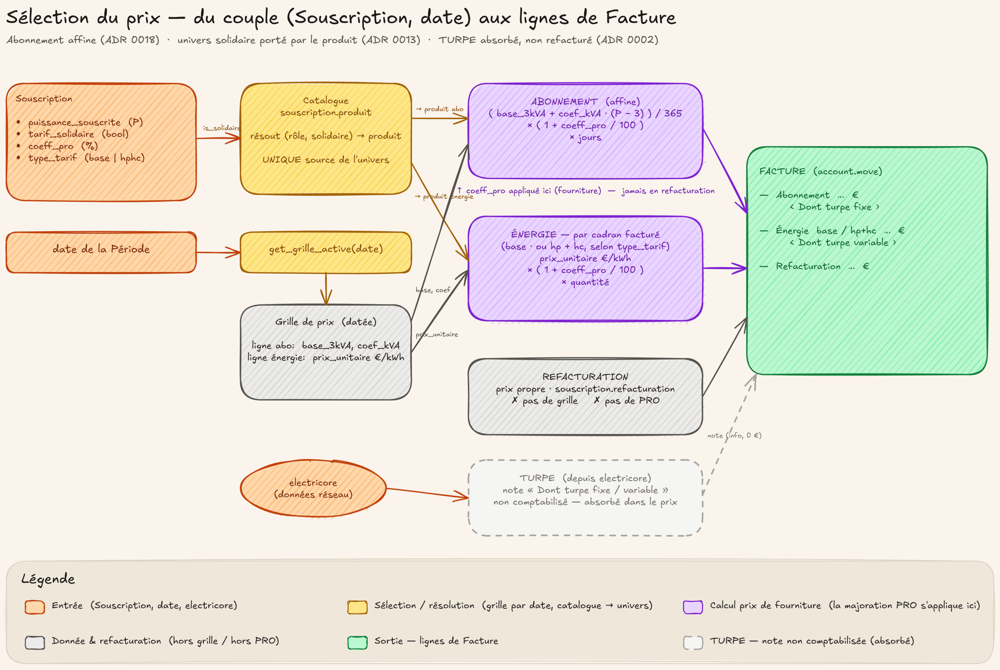

# Les prix

## En deux mots

Les prix ne sont pas éparpillés dans les contrats : ils vivent dans des **grilles**,
des barèmes datés qui valent pour tout le monde à partir d'un 1er du mois. Quand le
tarif change, on crée une nouvelle grille — l'ancienne reste en place et continue de
servir pour les mois qu'elle couvrait. C'est ce qui garantit qu'une facture d'un mois
passé retrouve toujours les prix de l'époque, jamais ceux d'aujourd'hui.

## Le geste au quotidien

### Où vivent les grilles

Menu **Souscriptions → Grilles de Prix** (réservé au rôle gestionnaire — affiché « Souscriptions / Gestionnaire » dans Odoo).
Chaque carte est un barème valable **à partir d'un 1er du mois**. La date de fin ne
se saisit jamais : elle se déduit toute seule du début de la grille suivante du même
régime. Une grille sans successeur est simplement « encore ouverte » — rien à fermer
à la main, jamais.

### Lire une grille : l'onglet « Tous les Prix »

Dans une grille, l'onglet **Tous les Prix** liste les lignes, une par produit de
facturation :

- pour l'**abonnement** (la part fixe du prix), deux nombres suffisent : le prix de
  base à 3 kVA (en €/an) et le coefficient par kVA supplémentaire (en €/an) ;
- pour l'**énergie**, le prix du kWh — un par cadran (Base, ou Heures pleines et
  Heures creuses), en version standard et en version solidaire.

L'unité et le prix interne (l'abonnement ramené en €/jour) se calculent
automatiquement — le·la facturiste ne saisit que les prix du barème.

### Changer de tarif : « dupliquer puis ajuster »

Le geste normal d'un changement de tarif tient en trois temps, depuis la grille en
cours :

1. **Dupliquer cette grille** (bouton en haut du formulaire) : la copie embarque
   tous les prix de l'actuelle, datée par défaut du 1er du mois suivant, et naît
   **en brouillon** (inactive) — elle ne perturbe rien tant qu'elle dort.
2. **Ajuster** : modifier les seuls prix qui bougent, vérifier la date de début
   (toujours un 1er du mois, l'écran refuse toute autre date) et le régime.
3. **Activer** : dès qu'elle est active, elle prend le relais à sa date de début et
   l'ancienne grille se referme d'elle-même, sans manipulation.

### Se tromper sans casser l'historique

Une grille erronée activée par mégarde ne se supprime pas : le bouton d'**archivage**
(icône archive, en haut du formulaire) la sort de la circulation. L'historique des
grilles sert aux factures des mois passés — le supprimer, ce serait fausser les
régularisations à venir (voir [regulariser](regulariser.md)).

### Comment la facture choisit ses prix

Pour facturer un mois donné, la facture ne demande jamais « quel est le prix
aujourd'hui ? » mais « quelle grille était en vigueur ce mois-là, pour le régime de
cette Souscription ? ». La réponse est mécanique : la grille la plus récente à avoir
commencé au plus tard ce mois-là. Facturer avec du retard, refacturer, régulariser :
tout retombe sur les prix de l'époque.

!!! question "🤖 À valider avec vous"
    - Un changement de barème prend TOUJOURS effet un 1er du mois : jamais de mois
      facturé à cheval sur deux barèmes, jamais de prorata de prix. Une hausse
      « au 15 » est donc impossible par construction. D'accord ?
    - Si un prix manque dans une grille, la facture (ou les conditions
      particulières) refuse de se générer, avec une erreur claire, plutôt que
      d'imprimer 0 €. Vous préférez bien l'erreur bloquante au document faux ?

## Les règles du jeu

**Le changement de grille tombe un 1er du mois, sans exception.** L'écran refuse
toute autre date de début. Conséquence heureuse : une Période (le mois facturable
d'un contrat) ne peut jamais enjamber deux barèmes, donc il n'existe pas de prix au
prorata — un mois, une grille, point.

**Jamais rétroactif.** Créer ou activer une grille ne réécrit aucun mois déjà
facturé ni aucun mois passé : la grille d'un mois est figée par l'histoire, pas par
l'écran du jour. C'est précisément ce qui rend la Régularisation juste : elle
valorise les écarts mesuré − facturé **aux prix historiques** de chaque mois couvert
(voir [regulariser](regulariser.md)).

**L'abonnement est une formule, pas une liste.** Prix annuel = base 3 kVA +
coefficient × (puissance − 3), le tout divisé par 365 pour donner le prix journalier.
Deux nombres à maintenir au lieu de neuf paliers ; en contrepartie, impossible de
donner un prix « spécial » à une seule puissance sans toucher toute la grille — et la
marge varie selon la puissance, c'est assumé.

**Deux régimes de prix : standard et Moulin.** Chaque Souscription porte son régime
(voir [contrat](contrat.md)) ; chaque régime versionne ses grilles indépendamment — une grille
Moulin ouverte coexiste avec une grille standard ouverte. Le tarif Moulin est un
barème à part entière avec ses propres grilles, jamais un pourcentage du standard.

**Le tarif solidaire n'est ni un régime ni une remise.** C'est une comptabilité
entièrement séparée du standard (exigence légale), portée par un jeu de produits de
facturation parallèle : la même grille contient les lignes standard et les lignes
solidaires, et le catalogue de produits choisit les bonnes.

**La majoration PRO** est un surcoût en %, négocié contrat par contrat. Elle
s'applique à l'abonnement et à l'énergie, jamais aux Refacturations Enedis (pur
transit de coût). Régime, solidaire et majoration PRO sont trois axes indépendants
qui se combinent librement.

**Le coût réseau (TURPE) est fondu dans les prix.** Les grilles sont tout-compris ;
sur la facture, le TURPE n'apparaît qu'en mention informative, jamais en ligne
facturée à part.

**Deux documents, deux dates, des montants qui peuvent différer.** Les conditions
particulières affichent les prix en vigueur au jour de la souscription ; la facture,
ceux du mois facturé. Après un changement de tarif, les deux divergent — c'est
voulu, pas un bug.

!!! question "🤖 À valider avec vous"
    - L'abonnement se calcule par formule (base 3 kVA + montant par kVA
      supplémentaire) : pas de prix « spécial » possible pour une seule puissance,
      et la marge varie selon la puissance. Cette contrepartie vous convient ?
    - Les conditions particulières montrent les prix du jour de la souscription,
      les factures ceux du mois facturé : après un changement de tarif, les
      montants diffèrent entre les deux documents. C'est clair pour tout le monde
      que ce n'est pas une anomalie à signaler ?

## Sous le capot

Modèles : [`grille.prix` et `grille.prix.ligne`](https://github.com/Energie-De-Nantes/souscriptions_odoo/blob/main/models/core/grille_prix.py) —
sélection de la grille en vigueur par `get_grille_active()` (la plus récente
`date_debut` ≤ date visée, par régime ; `date_fin` est un champ calculé, jamais
filtré), contrainte « 1er du mois » sur `date_debut`, moteur de prix unique
`composants()` (partition en cadrans, abonnement affine, majoration PRO, résolution
standard/solidaire — prix manquant lève une `UserError`), duplication en brouillon
via `dupliquer_cette_grille()`. Le catalogue standard/solidaire est résolu par
[`souscription.produit`](https://github.com/Energie-De-Nantes/souscriptions_odoo/blob/main/models/core/souscription_produit.py).

ADRs de référence :

- [ADR 0029 — Grille = moteur de prix unique, composants projetés par la Facture et les CP](https://github.com/Energie-De-Nantes/souscriptions_odoo/blob/main/docs/adr/0029-grille-moteur-prix-unique-composants-projections.md)
- [ADR 0018 — Tarif d'abonnement affine (base 3 kVA + coefficient par kVA)](https://github.com/Energie-De-Nantes/souscriptions_odoo/blob/main/docs/adr/0018-abonnement-affine-base-3kva-plus-coefficient-kva.md)
- [ADR 0013 — Isolation comptable solidaire/standard par produits parallèles](https://github.com/Energie-De-Nantes/souscriptions_odoo/blob/main/docs/adr/0013-isolation-comptable-solidaire-standard-produits-paralleles.md)
- [ADR 0002 — Deux sources de vérité ; TURPE absorbé, marge en analytique](https://github.com/Energie-De-Nantes/souscriptions_odoo/blob/main/docs/adr/0002-deux-sources-de-verite-marge-en-analytique.md)

Chantiers connexes : le contrôle de marge (prix affine − TURPE réel par palier) vit
dans la couche analytique, hors facturation (ADR 0002/0011) ; Tempo/EJP sont
explicitement hors périmètre — un nouveau type de tarif s'ajouterait dans le moteur
unique, en un seul fichier (ADR 0005/0029).
