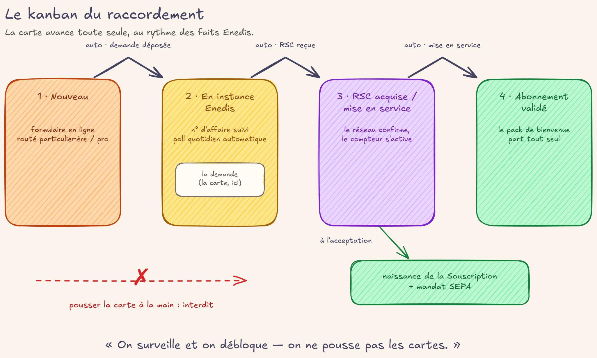

# Le raccordement

## En deux mots

Quand une personne demande à être fournie en électricité par la coopérative, sa demande
entre dans un tableau de suivi, colonne par colonne, de l'accueil jusqu'à la mise en
service. L'équipe vérifie le dossier et accepte la demande ; à partir de là, le contrat
existe et les cartes avancent toutes seules au rythme des confirmations du gestionnaire
du réseau. Le rôle humain : surveiller, et débloquer quand une carte s'allume en rouge.

## Le geste au quotidien

Le tableau vit dans **Raccordements → Demandes de raccordement** : une colonne par étape,
une carte par demande. Chaque colonne dit qui doit agir, par son préfixe :

- **🔴** — une action humaine est attendue ;
- **⏳** — personne n'a rien à faire, l'automate surveille ;
- **✓** — c'est fait (colonne repliée en bout de tableau).

### Accueillir la demande

Une nouvelle demande arrive en **🔴 Nouveau** si c'est un particulier, directement en
**🔴 PRO à valider** si la case « Professionnel » est cochée — c'est alors le collège qui
décide, et qui négocie la majoration PRO inscrite sur la demande.

La fiche **Demande de raccordement** est le seul formulaire à remplir : les infos du futur
contrat (PDL, puissance, tarif), le contact, et les onglets Provisions, Adhésion &
consentement (voir [consentement](consentement.md)), Informations bancaires et Notes. Deux vérifications
se font toutes seules à la saisie : le SIRET doit faire 14 chiffres, et l'IBAN est
contrôlé en direct — la case « IBAN validé » de la fiche dit où on en est.

### Accepter : le contrat naît

Glisser la carte en **🔴 Accepté et IBAN vérifié** est LE geste d'acceptation. Si le mode
de paiement est le prélèvement et que l'IBAN est invalide, le glissement est refusé — on
corrige l'IBAN d'abord, la colonne ne peut pas mentir.

À l'acceptation, tout se crée d'un coup, sans autre saisie :

- le **contact** — et si une personne avec le même email existe déjà, elle est réutilisée
  telle quelle, sans écraser son nom ni son adresse ;
- le **compte bancaire** et le **mandat SEPA, actif d'emblée** (en prélèvement) :
  l'acceptation est la porte de validation humaine, il n'y en a pas de seconde ;
- la **Souscription**, qui naît « en instance » — le contrat existe, mais rien n'est
  facturable tant que le réseau n'a pas confirmé (voir [contrat](contrat.md) pour les états).

### Laisser les faits avancer les cartes

L'accueilliste envoie la demande au gestionnaire de réseau (Enedis) et saisit sur la fiche
le **N° d'affaire Enedis** reçu, avec la **situation d'entrée** : mise en service (F120,
compteur hors service) ou changement de fournisseur (F130, logement déjà alimenté). Dès la
saisie, la carte avance seule vers la bonne colonne d'attente — **⏳ Mise en Service
(F120) en cours** ou **⏳ Changement de fournisseur (F130) en cours** — et le mail de
rassurage part vers le·la souscripteur·rice (voir [mails](mails.md)).

Ensuite, plus personne ne va vérifier l'affaire sur le portail d'Enedis : un automate
interroge **chaque jour** l'état des affaires en cours. Quand Enedis confirme la mise en
service (la RSC, l'identifiant définitif du contrat, est acquise), la carte avance seule
en **🔴 Validé sur SGE**. Impatient·e ? Le bouton **Résoudre la RSC maintenant**, sur la
fiche de la Souscription, interroge sans attendre le lendemain.

### Finir : mensualités et bienvenue

En **🔴 Calcul de mensualités en cours**, le bouton **Estimer les provisions** demande une
estimation des kWh mensuels pour proposer la mensualité du contrat lissé ; les champs
restent modifiables, et la saisie à la main est un chemin normal si l'estimation est
indisponible. Puis le glissement en **✓ Abonnement Validé** clôt le dossier et envoie le
pack de bienvenue : conditions particulières complètes et documents d'accueil ([mails.md](mails.md)).

!!! question "🤖 À valider avec vous"
    - Plus personne ne vérifie les affaires sur le portail SGE : l'automate interroge
      chaque jour et fait avancer les cartes ; un numéro d'affaire inconnu est toléré
      3 jours (délai normal côté Enedis) puis signalé comme probable faute de frappe.
      Ce partage humain/automate vous va ?
    - Le·la souscripteur·rice reçoit un accusé de prise en compte (« rassurage ») dès que
      la demande part chez Enedis, et les conditions particulières COMPLÈTES seulement à
      la validation de l'abonnement, quand mensualités et identifiant réseau sont connus —
      jamais une version estimée puis corrigée. Ce séquencement des envois est le bon ?

## Les règles du jeu

- **Le routage se fait à la création.** Particulier → « Nouveau » ; professionnel → « PRO
  à valider ». Pour un PRO, c'est le collège qui accepte et qui fixe la majoration PRO,
  recopiée sur la Souscription à sa naissance ; le SIRET est obligatoire.
- **La naissance a lieu à l'acceptation, pas à la fin.** La Souscription naît « en
  instance » : signée, complète commercialement, mais non facturable tant que la RSC
  manque. On ne facture jamais sur une identité douteuse. Le passage « en instance → en
  service » n'est pas un choix : il découle du fait (RSC acquise) — voir [contrat](contrat.md).
- **Un contact existant n'est jamais écrasé.** La réutilisation se fait par email, entre
  dossiers de même nature (une demande PRO ne peut pas retomber sur un particulier, ni
  l'inverse) ; l'identité du contact retrouvé reste intacte, seul le lien est tracé.
- **Les colonnes à entrée factuelle ne se forcent pas à la main.** Impossible de glisser
  une carte vers les branches F120/F130 ou vers « Validé sur SGE » : elles avancent
  seules quand le fait est là (n° d'affaire saisi, RSC acquise). Si ça bloque, on corrige
  la donnée, pas la colonne — le kanban ne peut pas mentir.
- **La situation d'entrée accompagne toujours le n° d'affaire.** Sans elle, la saisie est
  refusée : c'est elle qui choisit la branche d'attente. Se tromper de situation (F120 au
  lieu de F130) est un cas normal : on la corrige, la carte se re-route seule vers l'autre
  branche — jamais en arrière — et le mail de rassurage de la bonne branche part.
- **L'automate tolère, puis alerte.** Une affaire inconnue du réseau est tolérée 3 jours
  après la saisie (délai d'ingestion côté Enedis), puis la carte passe « Bloqué » (pastille
  rouge) avec UNE activité pour l'accueilliste — pas de rappel quotidien. Une ambiguïté
  alerte immédiatement. En dernier recours, la RSC reste saisissable à la main par un
  groupe restreint : l'état et la carte suivent.
- **Une correction se propage.** Un n° d'affaire corrigé sur la demande après la naissance
  se recopie aussitôt sur la Souscription — c'est elle qui porte la vérité, la carte ne
  fait que refléter.

!!! question "🤖 À valider avec vous"
    - Le contrat naît dès l'acceptation (IBAN vérifié, mandat signé) mais reste « en
      instance » — non facturable — tant qu'Enedis n'a pas confirmé la mise en service.
      C'est le bon moment de naissance ?
    - Une carte n'entre jamais à la main dans une colonne pilotée par un fait : on corrige
      la donnée et la carte suit. Et chaque colonne dit qui doit agir — humain (🔴),
      personne, l'automate veille (⏳), fait (✓). Cette lecture du tableau vous convient ?
    - Pour un professionnel, c'est le collège — jamais un·e accueilliste seul·e — qui
      accepte ET valide le tarif négocié (majoration PRO). Ce circuit correspond à vos
      pratiques ?

## Sous le capot

Modèles :

- [`models/raccordement/raccordement_demande.py`](https://github.com/Energie-De-Nantes/souscriptions_odoo/blob/main/models/raccordement/raccordement_demande.py)
  — la demande : routage à la création, gardes IBAN/SIRET, auto-move par situation
  d'entrée, mails de rassurage et pack de bienvenue, bouton d'estimation des provisions,
  orchestration de l'acceptation (`_create_odoo_entries`).
- [`models/raccordement/raccordement_stage.py`](https://github.com/Energie-De-Nantes/souscriptions_odoo/blob/main/models/raccordement/raccordement_stage.py)
  — les étapes du kanban (`entree_factuelle`, `is_close`), définies dans
  [`data/raccordement_stages.xml`](https://github.com/Energie-De-Nantes/souscriptions_odoo/blob/main/data/raccordement_stages.xml)
  et configurables dans **Raccordements → Configuration → Étapes** (groupe manager).
- [`models/core/souscription.py`](https://github.com/Energie-De-Nantes/souscriptions_odoo/blob/main/models/core/souscription.py)
  — `naitre_depuis_demande`, l'état calculé, le poll quotidien de la RSC, les alertes
  (grâce de 3 jours) et `action_resoudre_rsc_maintenant`.
- [`models/core/electricore_rsc_service.py`](https://github.com/Energie-De-Nantes/souscriptions_odoo/blob/main/models/core/electricore_rsc_service.py)
  — la résolution batch des affaires auprès d'electricore.
- [`models/core/souscription_sepa_mandat.py`](https://github.com/Energie-De-Nantes/souscriptions_odoo/blob/main/models/core/souscription_sepa_mandat.py)
  — le service de création du mandat SEPA à l'acceptation.

ADRs :

- [ADR 0022 — Raccordement aligné sur la prod : naissance à l'acceptation, « Validé sur SGE » par la RSC](https://github.com/Energie-De-Nantes/souscriptions_odoo/blob/main/docs/adr/0022-raccordement-aligne-prod-naissance-acceptation-valide-sge-rsc.md)
- [ADR 0021 — Chaîne pilotée par les faits : naissance en instance, RSC acquise par poll](https://github.com/Energie-De-Nantes/souscriptions_odoo/blob/main/docs/adr/0021-chaine-raccordement-pilotee-faits-naissance-instance-rsc-poll.md)
- [ADR 0010 — Identité de la Souscription : la RSC comme clé, l'id_Affaire comme amorce](https://github.com/Energie-De-Nantes/souscriptions_odoo/blob/main/docs/adr/0010-identite-souscription-rsc-cle-id-affaire-amorce.md)
- [ADR 0016 — Documents contractuels : projections de la Souscription, consentements captés au raccordement](https://github.com/Energie-De-Nantes/souscriptions_odoo/blob/main/docs/adr/0016-documents-contractuels-projection-souscription-consentements-raccordement.md)
- [ADR 0017 — Consentement aux données de consommation : formulaire public + journal append-only](https://github.com/Energie-De-Nantes/souscriptions_odoo/blob/main/docs/adr/0017-consentement-donnees-conso-formulaire-odoo-journal-append-only.md)
