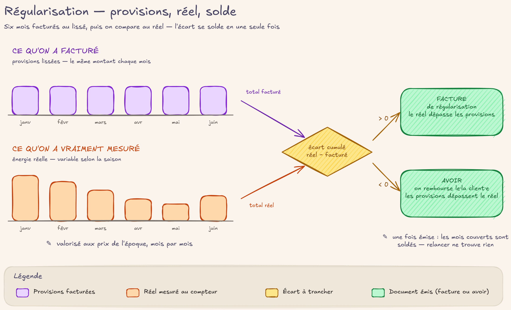

# Régulariser

## En deux mots

Beaucoup de contrats paient chaque mois une mensualité fixe, pendant que le compteur, lui,
tourne à son rythme. Régulariser, c'est comparer de temps en temps ce qui a été facturé avec ce
qui a été réellement consommé, puis solder la différence : un complément à payer si la
consommation dépasse, un remboursement si elle est en dessous. Le tout aux prix en vigueur au
moment de la consommation — jamais aux prix du jour.

## Le geste au quotidien

### D'où vient l'écart

Deux façons de facturer l'énergie cohabitent (voir [facture](facture.md)) :

- **Contrat non lissé** : chaque mensuelle facture l'énergie mesurée du mois. Il n'y a rien à
  régulariser — l'écart est nul par construction.
- **Contrat lissé** : chaque mensuelle facture une **provision** (la mensualité convenue),
  pendant que la mesure réelle continue d'arriver et de s'affiner. L'écart entre le mesuré et
  le facturé s'accumule mois après mois — c'est la matière première de la Régularisation.

### Lancer une régularisation

Tout part de la **fiche Souscription** : le bouton stat **« Régularisations »** (en haut de la
fiche) est l'entrée unique. Un clic trouve — ou crée — **le** brouillon de régularisation du
contrat (jamais deux à la fois) et le recalcule dans la foulée : le mesuré est rafraîchi, puis
tous les mois facturés à écart connu et non soldé sont ramassés.

Il n'y a **aucune date à choisir** : la Régularisation sélectionne elle-même ses mois
candidats. La relancer juste après un solde en produit une vide — ce n'est pas une panne,
c'est la preuve qu'il n'y a rien à solder.

La vue d'ensemble est dans le menu **Souscriptions → Régularisations** : toutes les
régularisations, leur période couverte, leur montant total et leur état (brouillon ou
facturée).

### Relire avant de solder

La **fiche Régularisation** est l'écran de relecture du·de la facturiste :

- les **lignes d'écart**, une par grille de prix et par cadran : kWh d'écart × prix
  historique de cette grille, avec le détail mois par mois sous chaque ligne ;
- les **signalements** du dernier recalcul : mois au verdict inconnu laissé de côté, compteur
  non communicant écarté, mois valorisé sur une estimation locale… ;
- les **relevés justificatifs** qui appuieront la facture.

Le bouton **« Recalculer »** refait tout le calcul, à volonté : rien n'est figé tant que rien
n'est émis. Quand la relecture convient, le bouton **« Facturer »** transforme la
régularisation en **facture** (si l'usager·ère doit) ou en **avoir** (si on lui doit) — un
brouillon, relisible comme toute facture (voir [facture](facture.md)), que l'émission viendra sceller.

### La sortie d'un·e usager·ère

Quand quelqu'un·e quitte la coopérative, la chaîne se déroule d'un bout à l'autre de la
Campagne de facturation, sans saisie manuelle :

1. **« Pull sorties C15 »** (fiche Campagne, phase Tirer) : les sorties signalées par le
   réseau arrivent d'elles-mêmes et posent la **date de fin** sur le contrat. Personne ne la
   tape à la main — c'est un fait, pas une décision.
2. Le contrat passe **« en attente de clôture »** : cet état *est* la file de travail des
   sorties (voir [contrat](contrat.md)). Elle est auto-cicatrisante : une sortie ratée un mois ressort
   d'elle-même au passage suivant.
3. La **dernière mensuelle se facture au réel**, même pour un contrat lissé : jours exacts,
   énergie exacte, relevés justificatifs — comme n'importe quelle mensuelle.
4. En fin de campagne, l'étape **« Régulariser les clôtures »** (fiche Campagne, phase
   Solder) émet d'un coup la régularisation de solde de chaque contrat en attente de clôture
   dont la dernière mensuelle est facturée. C'est une régularisation **ordinaire** — mêmes
   candidats, même calcul, mêmes prix historiques — mais son émission **ferme le livre** : le
   contrat passe à l'état **« résiliée »**, définitivement.

Un contrat dont la clôture n'est pas encore prête (dernière mensuelle pas émise, rien à solder
pour le moment) est simplement ignoré ce mois-ci et retenté au suivant — ni erreur, ni alarme.

!!! question "🤖 À valider avec vous"
    - On ne choisit jamais de dates : la régularisation ramasse automatiquement tous les mois
      facturés dont l'écart est connu et pas encore soldé. La relancer juste après en produit
      une vide — c'est normal, pas une panne. Cette absence de « fenêtre » à piloter vous va ?
    - Les compteurs non communicants (environ 25) ne passent pas par cette régularisation
      automatique : leur processus reste à concevoir avec vous, et l'ancienne heuristique
      « prix le moins cher » disparaît. Ce point est un chantier ouvert — on en parle ?

## Les règles du jeu

**L'écart, c'est mesuré moins facturé.** Pour chaque mois facturé d'un contrat lissé, la
Régularisation compare l'énergie réellement mesurée à l'énergie que les factures émises ont
portée. Seuls comptent les mois dont la mesure a un verdict fiable (réelle ou estimée) : un
mois au verdict inconnu attend, signalé, sans bloquer les autres.

**Les prix sont ceux de l'époque, pas ceux du jour.** Chaque mois d'écart est valorisé à la
grille de prix de *son* mois (voir [prix](prix.md)). Une régularisation qui couvre dix mois peut donc
mélanger plusieurs barèmes — la facture détaille la ventilation par barème et par cadran, pour
que le·la souscripteur·rice puisse tout vérifier.

**Jamais de facture négative.** Si le solde net est en faveur de l'usager·ère, la
régularisation part en **avoir** — un document de remboursement — jamais en facture à total
négatif. Une ligne isolée peut être négative (deux barèmes peuvent tirer en sens contraire) ;
seul le total du document compte.

**L'émission tamponne et trace.** Tant que la régularisation est en brouillon, tout est
recalculable à volonté ; c'est l'**émission** de sa facture qui fige. À cet instant, chaque
mensuelle couverte est tamponnée (son « facturé » absorbe l'écart soldé) et marquée du lien
vers la régularisation. Conséquences concrètes :

- **relancer aussitôt ne trouve rien** : les mois viennent d'être soldés, il n'y a plus
  d'écart ;
- **si la mesure s'affine plus tard, l'écart renaît tout seul** : la régularisation suivante
  l'avalera, sans manipulation particulière.

**Une régularisation émise ne se rouvre jamais.** Comme toute facture émise, elle est
immuable. La correction, c'est toujours une compensation — une nouvelle régularisation ou un
avoir (voir [facture](facture.md)) — jamais une annulation.

**« Je ne sais pas » n'écrase jamais « je savais ».** Si un mois redevient incalculable côté
réseau, la mesure déjà connue est conservée et le mois est signalé — on ne perd pas une
information acquise.

**La clôture ferme le livre.** À l'émission de la régularisation de clôture, *tous* les mois
du contrat sont marqués « régularisés » : plus aucun rappel ne peut naître, même si les
mesures s'affinent encore après. On ne recontacte pas quelqu'un·e de parti·e.

!!! note "Pourquoi les mois d'avant la bascule ne remontent jamais"
    Les contrats repris de l'ancien système sont arrivés avec leurs mois déjà soldés marqués
    « régularisée » — la migration a été traitée exactement comme une clôture. Un mois
    régularisé dans l'ancien système est réputé soldé pour toujours : le rouvrir déclencherait
    des avoirs en cascade sur des factures devenues inaltérables. La première régularisation
    d'après-bascule enjambe donc la migration sans code spécial : elle ne voit tout simplement
    jamais ces mois-là parmi ses candidats.

!!! question "🤖 À valider avec vous"
    - Une régularisation émise ne se rouvre jamais : si les mesures bougent encore, l'écart
      renaît et la suivante l'avale. La correction est toujours une compensation, jamais une
      annulation. D'accord avec ce principe ?
    - Un mois déjà régularisé dans l'ancien système est réputé soldé pour toujours, même si le
      calcul d'époque était douteux. Vous assumez ce trait définitif ?
    - À la clôture d'un contrat, une fois la régularisation de clôture émise, le livre est
      fermé : plus jamais de rappel, même si les mesures s'affinent après. Vous confirmez
      qu'on ne recontacte jamais quelqu'un·e de parti·e ?

## Sous le capot

Modèles et points d'entrée :

- [`models/core/souscription_regularisation.py`](https://github.com/Energie-De-Nantes/souscriptions_odoo/blob/main/models/core/souscription_regularisation.py)
  — `souscription.regularisation` (en-tête, lignes grille × cadran, écarts figés par mois) :
  `_recalculer()` (candidats sans fenêtre, idempotent), `_creer_facture()` (projection
  facture/avoir), `_solder_provisions()` (tampon + trace à l'émission, appelé par
  `account.move._post()`), `_marquer_regularisee_si_cloture()` (fermeture du livre).
- [`models/core/souscription.py`](https://github.com/Energie-De-Nantes/souscriptions_odoo/blob/main/models/core/souscription.py)
  — `action_regulariser()` derrière le bouton stat, `_regularisation_brouillon()` (jamais
  deux brouillons simultanés), état dérivé `en_attente_cloture`.
- [`models/core/souscription_campagne.py`](https://github.com/Energie-De-Nantes/souscriptions_odoo/blob/main/models/core/souscription_campagne.py)
  — étapes `pull_sorties_c15` et `regulariser_clotures` (skip-and-report par souscription).

ADRs de référence :

- [ADR 0030 — Le facturé gelé, le mesuré vivant](https://github.com/Energie-De-Nantes/souscriptions_odoo/blob/main/docs/adr/0030-facture-gele-mesure-vivant-regularisation-modele-propre-solde-tampon.md) :
  l'ADR central — candidats sans fenêtre, solde par tampon, re-régularisation gratuite quand
  la mesure bouge.
- [ADR 0008 — Mesuré ou provision selon le lissage](https://github.com/Energie-De-Nantes/souscriptions_odoo/blob/main/docs/adr/0008-quantite-facturee-mesure-ou-provision-selon-lissage.md) :
  fonde l'écart mesuré − facturé.
- [ADR 0029 — Grille de prix, moteur unique](https://github.com/Energie-De-Nantes/souscriptions_odoo/blob/main/docs/adr/0029-grille-moteur-prix-unique-composants-projections.md) :
  chaque mois valorisé à la grille de son mois.
- [ADR 0031 — Fin de souscription gouvernée par le fait C15](https://github.com/Energie-De-Nantes/souscriptions_odoo/blob/main/docs/adr/0031-fin-souscription-gouvernee-fait-c15-sorties-tirees-cloture-campagne.md) :
  sorties tirées, dernière mensuelle au réel, régularisation de clôture, marqueur
  « régularisée ».
- [ADR 0023 — Migration des contrats](https://github.com/Energie-De-Nantes/souscriptions_odoo/blob/main/docs/adr/0023-migration-contrats-100pct-couture-regul-enjambante-backfill-cible.md) :
  « settled is settled », régularisation enjambante à la bascule.
- [ADR 0011 — Pull facturiste, clé (RSC, mois)](https://github.com/Energie-De-Nantes/souscriptions_odoo/blob/main/docs/adr/0011-contrat-pull-facturation-electricore-cle-rsc-mois.md) :
  le rafraîchissement du mesuré, même après facturation.
- [ADR 0015 — Relevés d'index](https://github.com/Energie-De-Nantes/souscriptions_odoo/blob/main/docs/adr/0015-releves-index-enfant-fige-periode-projete-facture.md) :
  un relevé réel arrivé en retard part naturellement en régularisation.
